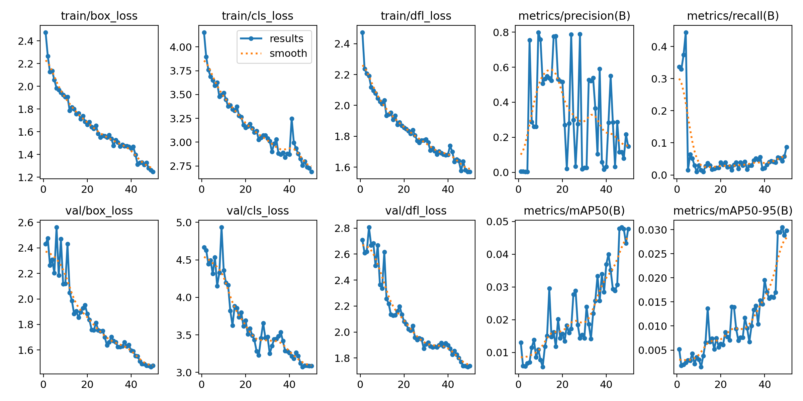
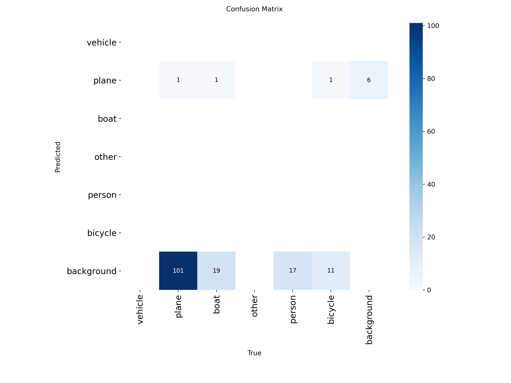

# Baseline Model Results (YOLOv8n)

This report documents the performance of the baseline YOLOv8 Nano model trained purely on the VEDAI thermal dataset without any custom augmentations.

* **Date:** 2025-11-08
* **Model:** YOLOv8n (Ultralytics)
* **Dataset:** VEDAI (Thermal only, standard 80/20 split)
* **Image Size:** 512x512
* **Epochs:** 50

## Key Metrics (Epoch 50)

| Metric | Score | Notes |
| :--- | :--- | :--- |
| **mAP @ 50% IoU** | **0.05** | Baseline target to beat in Phase 3. |
| **mAP @ 50-95% IoU** | **0.03** | Indicates difficulty in precise localization. |
| Precision | 0.15 | |
| Recall | 0.09 | Model is missing most objects (high false negative rate). |

> **Note:** These low baseline scores confirm that training on raw, small thermal datasets is extremely challenging. This strongly justifies our Phase 3 plan to use specialized **Thermal Augmentations** and **SAHI tiling** to improve performance.

---

## Training Curves
Visualizing the loss and metrics over training epochs.

---

## Confusion Matrix
Understanding misclassifications between classes.

